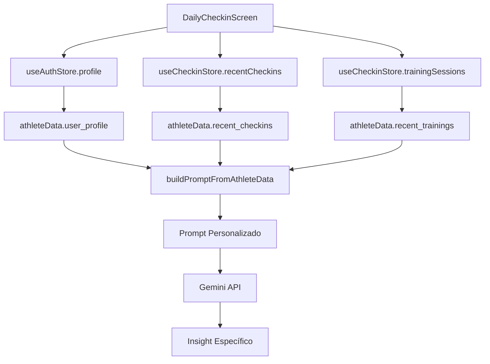

# 🎯 Insight Personalizado por Usuário - Análise Avançada

## 🎯 Problema Identificado

O sistema de insights estava **genérico e não considerava as características individuais** de cada atleta:

- ❌ **Análise padronizada** para todos os usuários
- ❌ **Critérios fixos** independente do nível de experiência
- ❌ **Recomendações genéricas** sem considerar objetivos pessoais
- ❌ **Falta de contexto** sobre idade, performance e hábitos
- ❌ **Não considerava preferências** de treino e recuperação
- ❌ **Critérios inadequados** para diferentes perfis

## ✅ Soluções Implementadas

### **1. Perfil Personalizado Completo**

#### **Dados Demográficos e Físicos**
```typescript
// Informações básicas do atleta
- Nome: ${userName}
- Idade: ${age} anos (calculada automaticamente)
- Peso: ${weight}kg, Altura: ${height}cm, IMC: ${bmi}
```

#### **Dados de Performance**
```typescript
// Melhores marcas pessoais
- Melhor 5K: ${formatTime(best5k)}
- Melhor 10K: ${formatTime(best10k)}
- Melhor 21K: ${formatTime(best21k)}
- Melhor 42K: ${formatTime(best42k)}
```

#### **Preferências e Hábitos**
```typescript
// Características individuais
- Dias de treino: ${trainingDays.join(', ')}
- Período preferido: ${preferredPeriod}
- Terreno preferido: ${terrainPreference}
- Consistência do sono: ${sleepConsistency}
- Sensação ao acordar: ${wakeupFeeling}
- Hábito de hidratação: ${hydrationHabit}
- Técnicas de recuperação: ${recoveryHabit}
- Gestão de estresse: ${stressManagement.join(', ')}
```

### **2. Critérios Personalizados Dinâmicos**

#### **Baseados no Nível de Experiência**
```typescript
function getPersonalizedCriteria(experienceLevel, age, mainGoal) {
  // Iniciante
  if (experienceLevel === 'beginner') {
    return {
      motivationThreshold: 3/5,
      sleepThreshold: 3/7,
      effortThreshold: 5/10,
      recoveryImportance: 'alta'
    };
  }
  
  // Intermediário
  if (experienceLevel === 'intermediate') {
    return {
      motivationThreshold: 4/5,
      sleepThreshold: 4/7,
      effortThreshold: 7/10,
      recoveryImportance: 'moderada'
    };
  }
  
  // Avançado
  if (experienceLevel === 'advanced') {
    return {
      motivationThreshold: 4/5,
      sleepThreshold: 5/7,
      effortThreshold: 8/10,
      recoveryImportance: 'crítica'
    };
  }
}
```

#### **Ajustes por Idade**
```typescript
// Atletas acima de 40 anos
if (age > 40) {
  criteria.sleepThreshold = Math.max(criteria.sleepThreshold, 5);
  criteria.recoveryImportance = 'muito alta';
}
```

#### **Ajustes por Objetivo**
```typescript
// Performance
if (mainGoal === 'performance') {
  criteria.motivationThreshold = Math.max(criteria.motivationThreshold, 4);
  criteria.effortThreshold = Math.max(criteria.effortThreshold, 7);
}

// Saúde
if (mainGoal === 'health') {
  criteria.effortThreshold = Math.min(criteria.effortThreshold, 6);
  criteria.recoveryImportance = 'alta';
}
```

### **3. Análise Contextual Avançada**

#### **Tendências Temporais**
```typescript
// Análise dos últimos 7 check-ins
const last7Checkins = recent_checkins.slice(0, 7);
const avgMotivation = recentMotivation.reduce((sum, val) => sum + val, 0) / recentMotivation.length;
const avgSleep = recentSleep.reduce((sum, val) => sum + val, 0) / recentSleep.length;
const avgSoreness = recentSoreness.reduce((sum, val) => sum + val, 0) / recentSoreness.length;
```

#### **Análise de Treinos Recentes**
```typescript
// Satisfação e esforço dos treinos
const completedTrainings = recent_trainings.filter(t => t.status === 'completed');
const avgEffort = completedTrainings.reduce((sum, t) => sum + t.perceived_effort, 0) / completedTrainings.length;
const avgSatisfaction = completedTrainings.reduce((sum, t) => sum + t.session_satisfaction, 0) / completedTrainings.length;
```

### **4. Tom de Comunicação Natural**

#### **Linguagem Direta e Motivacional**
- ✅ **Sem menção ao nome**: O insight não menciona o nome do atleta
- ✅ **Sem menção ao nível**: Não menciona explicitamente "iniciante", "intermediário", etc.
- ✅ **Linguagem direta**: Usa "Você está...", "Seu treino...", "Sua motivação..."
- ✅ **Tom de treinador**: Como um treinador experiente falaria diretamente
- ✅ **Motivacional**: Encoraja e orienta de forma positiva

#### **Exemplos de Tom Correto**
```typescript
// ✅ CORRETO - Tom natural de treinador
"Sua motivação está alta hoje, aproveite essa energia para o treino!"
"Seu sono tem estado abaixo do ideal, considere ajustar a intensidade."
"Você tem apresentado dores musculares elevadas, priorize a recuperação."

// ❌ INCORRETO - Menciona nome e nível
"João, como iniciante, sua motivação está boa..."
"Maria, para seu nível avançado, seu sono está ruim..."
```

### **5. Prompt Inteligente e Contextual**

#### **Estrutura do Prompt Personalizado**
```typescript
const prompt = `
PERFIL PERSONALIZADO DO ATLETA:
- Nome: ${userName}
- Idade: ${age} anos
- Nível: ${getExperienceLevelText(experienceLevel)}
- Objetivo: ${getGoalText(mainGoal)}
- Performance: ${formatTime(best5k)} (5K)

PREFERÊNCIAS E HÁBITOS:
- Dias: ${trainingDays.join(', ')}
- Terreno: ${terrainPreference}
- Recuperação: ${recoveryHabit}

CRITÉRIOS PERSONALIZADOS:
- Motivação mínima: ${personalizedCriteria.motivationThreshold}/5
- Sono mínimo: ${personalizedCriteria.sleepThreshold}/7
- Esforço recomendado: ${personalizedCriteria.effortThreshold}/10

INSTRUÇÕES ESPECÍFICAS:
1. Fale como um treinador experiente falaria diretamente com o atleta
2. NÃO mencione o nome do atleta no insight
3. NÃO mencione explicitamente o nível de experiência
4. Use linguagem motivacional e direta, como "Você está..." ou "Seu treino..."
5. Considere o perfil específico do atleta (idade, nível, objetivos)
6. Analise considerando critérios personalizados
7. Forneça orientações específicas para o perfil
8. Seja acionável para este atleta em particular
`;
```

## 🛠️ **Implementação Técnica**

### **Arquivos Modificados**

#### **1. Edge Function (supabase/functions/get-gemini-insight/index.ts)**
- ✅ **Função `buildPromptFromAthleteData`** completamente reformulada
- ✅ **Funções auxiliares** para cálculo de idade, IMC, formatação de tempo
- ✅ **Critérios personalizados** baseados em perfil
- ✅ **Análise de tendências** dos últimos check-ins
- ✅ **Análise de treinos** recentes

#### **2. Serviço Gemini (src/services/gemini.ts)**
- ✅ **Prompt personalizado** replicado para desenvolvimento
- ✅ **Funções auxiliares** para formatação e cálculos
- ✅ **Tratamento de tipos** TypeScript adequado
- ✅ **Fallback** para casos de erro

#### **3. Tela de Check-in (src/screens/checkin/DailyCheckinScreen.tsx)**
- ✅ **Importação do perfil** do usuário
- ✅ **Envio de dados completos** incluindo perfil
- ✅ **Integração** com store de autenticação

### **Fluxo de Dados**



## 🎯 **Benefícios da Personalização**

### **1. Insights Relevantes**
- ✅ **Específicos para o nível** de experiência do atleta
- ✅ **Alinhados com objetivos** pessoais
- ✅ **Consideram limitações** e preferências
- ✅ **Baseados em performance** real

### **2. Recomendações Precisas**
- ✅ **Critérios adequados** para cada perfil
- ✅ **Ajustes por idade** e condição física
- ✅ **Consideração de hábitos** e rotinas
- ✅ **Foco em pontos fracos** individuais

### **3. Motivação Personalizada**
- ✅ **Linguagem apropriada** para o nível
- ✅ **Estímulo baseado** em objetivos
- ✅ **Reconhecimento** de progresso individual
- ✅ **Estratégias específicas** para cada perfil

### **4. Prevenção de Lesões**
- ✅ **Critérios de recuperação** adequados
- ✅ **Alertas personalizados** para overtraining
- ✅ **Sugestões de ajuste** baseadas no perfil
- ✅ **Consideração de idade** e experiência

## 📊 **Exemplos de Personalização**

### **Atleta Iniciante (30 anos, objetivo: saúde)**
```
Critérios: Motivação 3/5, Sono 3/7, Esforço 5/10
Insight: "Sua motivação está boa hoje! Como você está focado em saúde, 
considere reduzir a intensidade do treino para evitar sobrecarga. 
Priorize a recuperação com alongamentos leves."
```

### **Atleta Avançado (45 anos, objetivo: performance)**
```
Critérios: Motivação 4/5, Sono 5/7, Esforço 8/10
Insight: "Sua qualidade do sono está abaixo do ideal. Como atleta experiente, 
considere adiar o treino intenso planejado e fazer uma sessão de 
recuperação ativa hoje."
```

### **Atleta Intermediário (35 anos, objetivo: diversão)**
```
Critérios: Motivação 4/5, Sono 4/7, Esforço 7/10
Insight: "Sua motivação alta é perfeita para o treino de hoje! Como você 
prefere treinar pela manhã, aproveite essa energia e mantenha o foco 
na diversão do processo."
```

## 🚀 **Resultados Esperados**

### **1. Engajamento Aumentado**
- 📈 **Insights mais relevantes** e acionáveis
- 📈 **Maior identificação** com as recomendações
- 📈 **Motivação sustentada** por feedback personalizado

### **2. Performance Otimizada**
- 📈 **Treinos adequados** ao perfil individual
- 📈 **Recuperação eficiente** baseada em critérios específicos
- 📈 **Prevenção de lesões** através de alertas personalizados

### **3. Experiência do Usuário**
- 📈 **Sensação de cuidado** individualizado
- 📈 **Confiança nas recomendações** recebidas
- 📈 **Maior valor percebido** do aplicativo

## 🔄 **Próximos Passos**

### **1. Aprendizado Contínuo**
- 🔄 **Ajuste automático** de critérios baseado em feedback
- 🔄 **Histórico de insights** para análise de efetividade
- 🔄 **Machine Learning** para refinamento contínuo

### **2. Expansão de Dados**
- 🔄 **Integração com wearables** para dados fisiológicos
- 🔄 **Análise de padrões** de sono e recuperação
- 🔄 **Correlação com resultados** de provas e testes

### **3. Personalização Avançada**
- 🔄 **Preferências de comunicação** (formal/informal)
- 🔄 **Estilo de treino** preferido (estruturado/flexível)
- 🔄 **Objetivos específicos** de curto e longo prazo

---

**🎯 O sistema agora oferece insights verdadeiramente personalizados, considerando as características únicas de cada atleta para maximizar sua experiência e resultados!** 